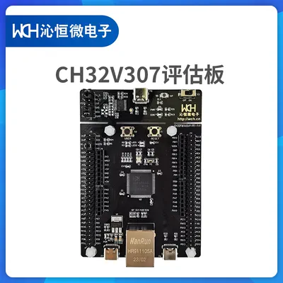
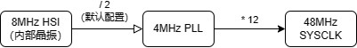
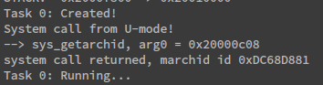
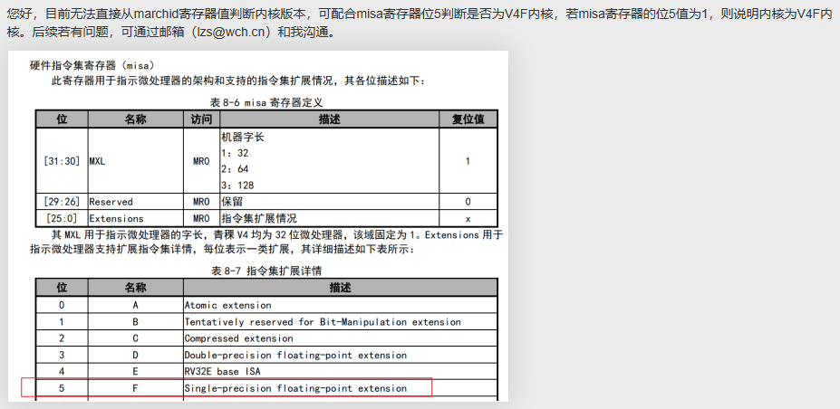

**RVOS_ch32v307**

<!-- TOC -->

- [介绍](#介绍)
- [准备](#准备)
  - [Linux](#linux)
  - [MACOS](#macos)
- [运行](#运行)
- [可能遇到的问题](#可能遇到的问题)
  - [1. 找不到 libhidapi-hidraw.so.0](#1-找不到-libhidapi-hidrawso0)
  - [2. 报错 LIBUSB\_ERROR\_ACCESS](#2-报错-libusb_error_access)
- [说明](#说明)
  - [00. 启动](#00-启动)
  - [01. 基本串口输出](#01-基本串口输出)
  - [02. 内存管理](#02-内存管理)
  - [03. 上下文切换](#03-上下文切换)
  - [04. 协作式多任务](#04-协作式多任务)
  - [05. Trap 和 Exception](#05-trap-和-exception)
  - [06. 外部设备中断](#06-外部设备中断)
  - [07. 硬件定时器](#07-硬件定时器)
  - [08. 抢占式多任务](#08-抢占式多任务)
  - [09. 任务同步和锁](#09-任务同步和锁)
  - [10. 软件定时器](#10-软件定时器)
  - [11. 系统调用](#11-系统调用)

<!-- /TOC -->

# 介绍

此仓库为 [RVOS 课程](https://www.bilibili.com/video/BV1Q5411w7z5)在 ch32v307 开发板上的移植，目前已完成：
- [x] 00-bootstrap
- [x] 01-helloRVOS
- [x] 02-memanagement
- [x] 03-contextswitch
- [x] 04-multitask
- [x] 05-traps
- [x] 06-interrupts
- [x] 07-hwtimer
- [x] 08-preemptive
- [x] 09-lock
- [x] 10-swtimer
- [x] 11-syscall
- [x] exercise-7-1-helloRVOS-asm
- [x] exercise-7-2-helloRVOS-echo
- [x] exercise-8-1-memanagement-byte
- [x] exercise-9-1-multitask-with param, priority and exit
- [x] exercise-9-2-multitask-scheduletask
- [ ] exercise-11-1-uart-write-interrupt
- [x] exercise-12-1-digital-clock
- [ ] exercise-14-1-spinlock
- [ ] ...

使用的硬件为自带 WCH-Link 的 CH32V307V 评估板：



由于开发板上自带调试器，可以很方便地进行下载和调试，便于我们学习 Risc-V 底层开发。

# 准备

## Linux

工具安装：

Debian / Ubuntu：
```shell
sudo apt install gcc-riscv64-unknown-elf binutils-riscv64-unknown-elf gdb-multiarch
```

Archlinux：
```shell
sudo pacman -S riscv64-elf-gcc riscv64-elf-binutils riscv64-elf-gdb
```

下载代码以及 OpenOCD 工具：
```shell
git clone https://github.com/Judehahh/RVOS_ch32v307.git
cd RVOS_ch32v307
wget http://file.mounriver.com/tools/MRS_Toolchain_Linux_x64_V1.80.tar.xz
tar -xvf MRS_Toolchain_Linux_x64_V1.80.tar.xz
```

## MACOS

> 只在 x86 中经过验证，arm （理论上）需要解压 MRS_Toolchain 中的 arm 架构的 openocd 压缩文件，并修改 `common.mk` 文件中的 openocd 路径。

工具安装：
```shell
brew install riscv64-elf-binutils riscv64-elf-gcc riscv64-elf-gdb
```

下载代码以及 OpenOCD 工具：
```shell
git clone https://github.com/Judehahh/RVOS_ch32v307.git
cd RVOS_ch32v307
wget wget http://file.mounriver.com/tools/MRS_Toolchain_MAC_V190.zip
unzip MRS_Toolchain_MAC_V190.zip
cd MRS_Toolchain_MAC_V190
unzip openocd_x86_64.zip
cd ..
```

# 运行

编译：
```shell
cd 01-helloRVOS
make
```

将 wch-link 接入电脑，运行以下命令将代码刷入开发板中：
```shell
make flash
```

使用`57600`波特率打开串口，按下开发板上的`RESET`按钮，即可观察到输出：    


调试代码：
```shell
make debug
```
目前 debug 存在在关闭 gdb 后无法关闭 openocd 的问题，需要手动 kill 掉进程

查看反汇编：
```shell
make code
```

# 可能遇到的问题

## 1. 找不到 libhidapi-hidraw.so.0

运行 `make flash` 报错：
```
../MRS_Toolchain_Linux_x64_V1.80/OpenOCD/bin/openocd: error while loading shared libraries: libhidapi-hidraw.so.0: cannot open shared object file: No such file or directory
```

解决：
```shell
cd MRS_Toolchain_Linux_x64_V1.80/beforeinstall/
./start.sh
```

## 2. 报错 LIBUSB_ERROR_ACCESS

运行 `make flash` 报错：
```
Error: libusb_open() failed with LIBUSB_ERROR_ACCESS
Error: open failed
```

解决：

在执行过 `start.sh` 之后执行以下命令
```shell
sudo groupadd plugdev
sudo usermod -a -G plugdev $USER
sudo udevadm control --reload-rules && sudo udevadm trigger
```

完成以上步骤后需要重新登陆一下 linux 用户。

# 说明

一切的开始前，需要先准备好芯片相关手册：
- QingKeV4微处理器手册：[QingKeV4_Processor_Manual.PDF](https://www.wch.cn/downloads/QingKeV4_Processor_Manual_PDF.html)
- CH32FV2x_V3xRM应用手册：[CH32FV2x_V3xRM.PDF](https://www.wch.cn/downloads/CH32FV2x_V3xRM_PDF.html)
- CH32V307数据手册：[CH32V307DS0.PDF](https://www.wch.cn/downloads/CH32V307DS0_PDF.html)

接着要确保开发板的 Flash 分配为 256K，RAM 为 64K。（这应该是开发板的默认设置）

## 00. 启动

查看《CH32V307DS0.PDF》的第 2 章的存储器地址映射图，得知开发板的 Flash 从 `0x00000000` 开始。因此，将 `Makefile` 中的 `-Ttext` flag 从 `0x80000000 ` 改为 `0x00000000`。

而 RAM 的始址为 `0x20000000`，加上 64K 的容量，RAM 在 `0x20010000` 处结束，因此在启动时将 `sp` 指针指向 `0x20010000`。

另外，由于 ch32v307 只有一个核，并且没有 `mhartid` 寄存器，因此可以省略 hart 相关的代码。

## 01. 基本串口输出

这一章的移植比较费工夫， 作为一个 MCU 开发板，我们在使用外设之前，需要先自己配置好时钟（RCC），对这块不熟悉的同学可以先到b站上搜索一下 stm32 开发板相关的时钟树教学视频来了解一下相关概念（ch32 的相关资源较少，可以使用 stm32 作为参考）。

从《CH32FV2x_V3xRM.PDF》的第 2 章中的图 2-3 可以了解 ch32v307 的时钟树架构，以下为本章代码的时钟配置简单示意图：



最终我们将 PLL 输出的 48Mhz 时钟配置为系统时钟，然后我们就可以启用 UART 和 A 组 GPIO 的时钟了（UART1 对应的 GPIO 为 GPIO PA9）。详细的说明可以参考《CH32FV2x_V3xRM.PDF》的第 10 章与第 18 章。

## 02. 内存管理

从这一章开始加入了链接脚本，与课程中不同的是，MCU 中通常将 bin 文件都放在 Flash 中。在运行时，text 段与 rodata 段都是在 Flash 中直接读取及运行，而 data 段与 bss 段则需要放在 RAM 中。因此在启动时需要**手动将 data 段从 Flash 搬到 RAM 中**，同时清空 bss 段。

```asm
    # load data section from flash to RAM
    la      a0, _data_lma
    la      a1, _data_vma
    la      a2, _data_end
    bgeu    a1, a2, 2f
1:
    lw      t0, (a0)
    sw      t0, (a1)
    addi    a0, a0, 4
    addi    a1, a1, 4
    bltu    a1, a2, 1b
2:
    # clear bss section
    la      a0, _bss_start
    la      a1, _bss_end
    bgeu    a0, a1, 2f
1:
    sw      zero, (a0)
    addi    a0, a0, 4
    bltu    a0, a1, 1b
```

## 03. 上下文切换

本章代码与课程相同。

## 04. 协作式多任务

本章代码与课程相同。

## 05. Trap 和 Exception

青稞 V4 中使用*可编程快速中断控制器*（Programmable Fast Interrupt Controller, PFIC）来管理异常和中断，与 QEMU 中的 PLIC 不同，具体可参考 《CH32FV2x_V3xRM.PDF》 的第 9 章以及《QingKeV4_Processor_Manual.PDF》的第 3 章。

异常处理流程与课程中基本一致。

## 06. 外部设备中断

PFIC 的设置与课程中有些许不同，若要开启某个中断，需在 PFIC init 时 `PFIC_IENRx` (x = 1, 2, 3, 4) 寄存器中将该中断号对应的位置位。如“USART1 全局中断”的编号为 `53`，需要将 `PFIC_IENR2` 的第 $53 - 32 = 21$ 位置1。
```c
/* enable usart1 interrupts. */
*(uint32_t *)PFIC_IENR2 |= (uint32_t)(0x00200000);
```

## 07. 硬件定时器

由于外设寄存器数量增加，参照沁恒官方的写法，修改成以 `struct` 的方式来读写寄存器，使寄存器读写操作更加方便；同时将 rcc 的初始化工作分离出来到 `rcc.c` 中。

对于 CH32V307 的定时器，青稞 V4 内部设计了一个 SysTick，具体参考《QingKeV4_Processor_Manual.PDF》的第5章。

要开启定时器中断，需要在 PFIC 将 `IENR1` 的第 12 位置 1（即 `12` 号中断）。
```c
/* enable SysTick interrupts. */
PFIC_REG->IENR[0] |= (uint32_t)(0x00001000);
```

在每次时钟中断发生后，需要清除计数值比较标志，否则会一直触发中断，同时清除定时器计数值（或者继续增加 CMP 的值）：
```c
void timer_handler()
{
    STK_REG->CTLR |= (uint32_t)(1 << 5);
    // STK_REG->CMP += (uint64_t)(p_ms * 1000);

    STK_REG->SR &= ~(1 << 0);
}
```

## 08. 抢占式多任务

软件中断中断号为 `14`，需在 `PFIC_REG->IENR[0]` （即 `IENR1`）中打开。

## 09. 任务同步和锁

本章代码与课程相同。

## 10. 软件定时器

本章代码与课程相同。

## 11. 系统调用

根据《QingKeV4_Processor_Manual.PDF》中 csr 寄存器的相关介绍，青稞 V4 中并没有 `mhartid` 寄存器，我们这里通过读 `marchid` 寄存器来实现相同的功能，该寄存器同样为 **MRO**（仅机器模式可读）。

> 注意：我读取了 `marchid` 寄存器发现读得的值为 `0xDC68D881`，但官方手册中说青稞 V4F 应该为 `0xDC68D886`
> 
>
> 在沁恒社区中官方给出的解释如下：
> 
>
> 这可能是芯片本身存在的问题，各位可以自己尝试读取 `misa` 寄存器验证一下。